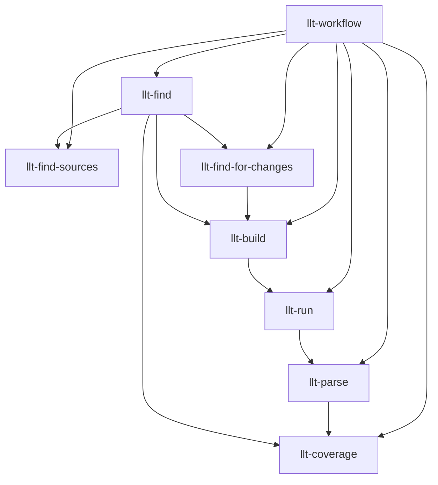

# LowLevelTests Skills Suite - Software Design Document

**Version:** 1.1
**Date:** 2026-02-17
**Author:** Claude Code
**Status:** Draft

---

## Table of Contents

1. [Executive Summary](#executive-summary)
2. [Background & Context](#background--context)
3. [Architecture Overview](#architecture-overview)
4. [Skill Specifications](#skill-specifications)
5. [Implementation Details](#implementation-details)
6. [Integration with Dante Plugin](#integration-with-dante-plugin)
7. [Testing Strategy](#testing-strategy)
8. [Deployment & Maintenance](#deployment--maintenance)
9. [Appendices](#appendices)

---

## 1. Executive Summary

### 1.1 Purpose

This document specifies the design for a comprehensive suite of dante plugin skills to support Unreal Engine's **LowLevelTest (LLT)** framework within the Fortnite codebase. The skills enable discovery, building, execution, analysis, and coverage assessment of LLTs for both Engine and FortniteGame projects.

### 1.2 Goals

- **Discover** all LowLevelTest files across Engine and FortniteGame codebases
- **Build** LLT test targets using UnrealBuildTool (UBT) and BuildGraph
- **Execute** tests locally and via Gauntlet automation
- **Parse** test output (Catch2 XML and console formats) to extract results
- **Analyze** test coverage and relationships to source code
- **Locate** relevant header and plugin files being tested
- **Discover** affected tests for code changes (module dependency analysis)

### 1.3 Scope

**In Scope:**
- LowLevelTests in `/Engine/Source/Programs/LowLevelTests/`
- LowLevelTests in `/Engine/Source/Runtime/*/Tests/`
- LowLevelTests in `/FortniteGame/Source/*/Tests/`
- LowLevelTests in `/FortniteGame/Plugins/*/Tests/`
- Catch2-based tests (v3.4.0+)
- BuildGraph-based test execution
- Gauntlet test framework integration

**Out of Scope:**
- Unreal Automation Framework tests (`IMPLEMENT_SIMPLE_AUTOMATION_TEST`)
- Functional tests (AFunctionalTest)
- Blueprint-based tests
- PIE (Play In Editor) tests
- Dedicated server tests (different framework)

---

## 2. Background & Context

### 2.1 LowLevelTest Framework Overview

**LowLevelTests (LLTs)** are lightweight, minimal-overhead C++ unit tests in Unreal Engine built on the **Catch2** testing framework. They are designed for:

- **Fast iteration**: No PCH, no Unity builds, minimal dependencies
- **Platform coverage**: Win64, Mac, Linux, PS4, PS5, Xbox, Switch, iOS, Android
- **Module isolation**: Test Core, CoreUObject, Engine modules independently
- **CI/CD integration**: BuildGraph and Gauntlet automation support

### 2.2 Key Framework Components

| Component | Location | Purpose |
|-----------|----------|---------|
| **LowLevelTestsRunner** | `Engine/Source/Developer/LowLevelTestsRunner/` | Core test harness, platform adapters, Catch2 integration |
| **TestTargetRules** | `Engine/Source/Programs/UnrealBuildTool/.../TestTargetRules.cs` | UBT integration for test compilation |
| **TestModuleRules** | `Engine/Source/Programs/UnrealBuildTool/.../TestModuleRules.cs` | Module-level test metadata and dependencies |
| **BuildGraph LLTs** | `Engine/Build/LowLevelTests.xml`, `FortniteGame/Build/LowLevelTests.xml` | Test orchestration, platform matrix |
| **Gauntlet Integration** | `Engine/Source/Programs/AutomationTool/LowLevelTests/` | Test deployment and execution |
| **Catch2 Framework** | `Engine/Source/ThirdParty/Catch2/v3.11.0/` | Core test macros and assertions |

### 2.3 Test Framework Variants

#### A. Explicit Test Targets
- Self-contained test executables (e.g., `FoundationTests`, `OnlineTests`)
- Have `.Build.cs` (TestModuleRules) and `.Target.cs` (TestTargetRules)
- Compiled with `-Mode=Test` flag
- Located in `Engine/Source/Programs/LowLevelTests/` or plugin test directories

#### B. Implicit Tests

Implicit tests are LowLevelTests that lack explicit test module and target files (`.Build.cs` inheriting from `TestModuleRules`, `.Target.cs` inheriting from `TestTargetRules`).

**How they work:**
- Take an existing target (e.g., `UnrealGame`) as a base
- UBT constructs `TestModuleRules` and `TestTargetRules` instances at runtime
- Copy references and include paths from the base module (e.g., `UnrealGame.Build.cs`)
- Build a **separate executable** with all tests in the dependency graph
- **Remove** the main entrypoint and initialization logic from the base target
- Tests are NOT part of the original executable (e.g., not in `UnrealGame.exe`)

**Locations:**
- `Engine/Source/Runtime/*/Tests/` - Tests within runtime modules
- Tests anywhere in the dependency graph of the base target

**Compilation:**
- Compiled when `WITH_LOW_LEVEL_TESTS=1` macro is set
- Collected automatically by UBT when `bWithLowLevelTestsOverride=true`

**Current limitation:**
- **Cannot write tests directly in target's folder** (e.g., `UnrealGame/Tests/` won't work)
- Tests must be in module subdirectories within the dependency graph

**Why use implicit tests:**
- Easier to maintain (no separate .Build.cs/.Target.cs files)
- Automatically include tests from all module dependencies
- Harder to build (more complex UBT configuration)

#### C. Framework-Specific Variants

Some LLT implementations have specialized frameworks with additional patterns:

- **Online Tests**: See `skills/llt-online-tests.md` for OSSv2 testing patterns
- **WebTests**: See `skills/llt-web-tests.md` for webrunner integration

These variants use standard Catch2 macros but add framework-specific infrastructure.

### 2.4 Test Execution Models

| Model | Command | Use Case |
|-------|---------|----------|
| **Direct Execution** | `.\OnlineTests.exe [tags] --wait --debug --log` | Local development, quick iteration |
| **BuildCookRun** | `.\RunUAT.bat BuildCookRun -Project=OnlineTests -Stage -SkipCook --with-uba` | Manual staging and deployment |
| **BuildGraph** | `.\RunUAT.bat BuildGraph -Script=LowLevelTests.xml -Target="Online Tests Win64" --with-uba` | Full CI/CD pipeline |
| **RunLowLevelTests** | `.\RunUAT.bat RunLowLevelTests -testapp=OnlineTests -platform=XSX --with-uba` | Gauntlet-based console testing |

### 2.5 Test Macros & Patterns

#### Catch2 Macros (Primary Pattern)
```cpp
#include "TestHarness.h"

TEST_CASE("Test Name", "[Tag1][Tag2]")
{
    REQUIRE(condition);
    CHECK(condition);
}

TEST_CASE_METHOD(FTestFixture, "Test with Fixture", "[Tag]")
{
    SECTION("Subsection") {
        CHECK_EQUAL(actual, expected);
    }
}
```

#### Framework-Specific Patterns

For specialized test framework patterns, see:
- **Online Tests**: `skills/llt-online-tests.md` (builder pattern, async operations)
- **WebTests**: `skills/llt-web-tests.md` (webrunner integration)

### 2.6 Test Discovery Patterns

Based on codebase analysis:
- **195+ test files** in FortniteGame alone
- **135+ test files** in `Engine/Source/Runtime/Core/Tests/`
- **12 explicit test targets** in `Engine/Source/Programs/LowLevelTests/`
- **18 platform-specific runners** in `Engine/Platforms/*/Source/Developer/LowLevelTestsRunner/`

---

## 3. Architecture Overview

### 3.1 Skill Suite Design

```
dante_plugin/
├── skills/
│   ├── llt-find/              # Skill 1: Find LowLevelTests
│   ├── llt-build/             # Skill 2: Build LLT targets
│   ├── llt-run/               # Skill 3: Execute tests
│   ├── llt-parse/             # Skill 4: Parse test output
│   ├── llt-coverage/          # Skill 5: Analyze test coverage
│   ├── llt-find-sources/      # Skill 6: Find tested source files
│   ├── llt-workflow/          # Skill 7: End-to-end workflow orchestration
│   ├── llt-find-for-changes/  # Skill 8: Find tests for changed files
│   ├── llt-online-tests.md    # Framework reference: Online Tests (OSSv2)
│   └── llt-web-tests.md       # Framework reference: WebTests
```

### 3.2 Skill Dependencies



### 3.3 Data Flow

```
User Request
    ↓
llt-workflow (orchestrator)
    ↓
[1] llt-find: Discover test files
    → Output: List of test targets with metadata
    ↓
[2] llt-build: Compile test executables
    → Output: Build logs, executable paths
    ↓
[3] llt-run: Execute tests
    → Output: Test stdout/stderr, XML reports
    ↓
[4] llt-parse: Extract test results
    → Output: Structured test results (pass/fail/error counts)
    ↓
[5] llt-coverage: Analyze coverage
    → Output: Coverage metrics, untested modules
    ↓
[6] llt-find-sources: Map tests to source files
    → Output: Test-to-source relationships
```

### 3.4 Integration Points

| Integration | Purpose | Method |
|-------------|---------|--------|
| **UnrealBuildTool** | Compile test targets | Bash commands via `RunUBT.bat` |
| **AutomationTool** | BuildGraph execution | Bash commands via `RunUAT.bat` |
| **Catch2** | Test framework | Parse XML output, console output |
| **Gauntlet** | Test deployment | RunLowLevelTests command |
| **Dante Plugin** | Skill hosting | Skill manifest, agent invocation |

---

## 4. Skill Specifications

### 4.1 Skill 1: `llt-find`

**Purpose:** Discover all LowLevelTest files and test targets in the codebase.

#### Inputs
- `--path` (optional): Base directory to search (default: both Engine and FortniteGame)
- `--test-type` (optional): Filter by test type (`explicit`, `implicit`, `all`)
- `--platform` (optional): Filter by platform support (Win64, PS5, etc.)
- `--output-format` (optional): Output format (`json`, `table`, `summary`)

#### Outputs
```json
{
  "test_targets": [
    {
      "name": "FoundationTests",
      "type": "explicit",
      "location": "/Engine/Source/Programs/LowLevelTests/FoundationTests",
      "build_file": "FoundationTests.Build.cs",
      "target_file": "FoundationTests.Target.cs",
      "test_files": [
        {
          "path": "Tests/UObjectTests.cpp",
          "test_count": 8,
          "test_cases": [
            {
              "name": "UObject::Serialization",
              "line": 45,
              "tags": ["CoreUObject", "Serialization"],
              "sections": ["Setup", "Serialize", "Deserialize", "Verify"],
              "macro": "TEST_CASE"
            },
            {
              "name": "UObject::GarbageCollection",
              "line": 89,
              "tags": ["CoreUObject", "GC"],
              "sections": [],
              "macro": "TEST_CASE"
            }
          ],
          "includes": [
            "UObject/UObjectGlobals.h",
            "Serialization/Archive.h"
          ],
          "custom_macros_detected": []
        },
        {
          "path": "Tests/PackageNameTests.cpp",
          "test_count": 5,
          "test_cases": [
            {
              "name": "PackageName::Validation",
              "line": 23,
              "tags": ["CoreUObject", "Packages"],
              "sections": ["Valid Names", "Invalid Names"],
              "macro": "TEST_CASE"
            }
          ],
          "includes": [
            "UObject/PackageName.h"
          ],
          "custom_macros_detected": []
        },
        {
          "path": "Tests/ResonanceTests.cpp",
          "test_count": 12,
          "test_cases": [
            {
              "name": "Resonance::JoinAudioChannel",
              "line": 45,
              "tags": ["Resonance", "Audio"],
              "sections": [],
              "macro": "RESONANCE_TEST_CASE",
              "macro_wrapper": {
                "base_macro": "TEST_CASE",
                "wrapper_definition_file": "ResonanceTestMacros.h",
                "wrapper_definition_line": 23
              }
            },
            {
              "name": "Resonance::LeaveAudioChannel",
              "line": 62,
              "tags": ["Resonance", "Audio"],
              "sections": [],
              "macro": "RESONANCE_TEST_CASE",
              "macro_wrapper": {
                "base_macro": "TEST_CASE",
                "wrapper_definition_file": "ResonanceTestMacros.h",
                "wrapper_definition_line": 23
              }
            }
          ],
          "includes": [
            "Online/Resonance.h",
            "ResonanceTestMacros.h"
          ],
          "custom_macros_detected": [
            {
              "name": "RESONANCE_TEST_CASE",
              "wraps": "TEST_CASE",
              "definition_file": "ResonanceTestMacros.h",
              "definition_line": 23,
              "usage_count": 12
            }
          ]
        },
        {
          "path": "Tests/LinkedListBuilderTests.cpp",
          "test_count": 2,
          "test_cases": [
            {
              "name": "LinkedList::BuilderPattern",
              "line": 15,
              "tags": ["Foundation", "DataStructures"],
              "sections": [],
              "macro": "TEST_CASE"
            }
          ],
          "includes": [
            "Containers/LinkedList.h"
          ],
          "custom_macros_detected": []
        }
      ],
      "source_to_test_map": {
        "UObject/UObjectGlobals.h": [
          {
            "test_file": "Tests/UObjectTests.cpp",
            "test_cases": ["UObject::Serialization", "UObject::GarbageCollection"],
            "coverage": "direct"
          }
        ],
        "UObject/PackageName.h": [
          {
            "test_file": "Tests/PackageNameTests.cpp",
            "test_cases": ["PackageName::Validation"],
            "coverage": "direct"
          }
        ]
      },
      "dependencies": ["Core", "CoreUObject", "Cbor", "AssetRegistry"],
      "platforms": ["Win64", "Mac", "Linux", "Android", "iOS"],
      "test_count": 15,
      "tags": ["CoreUObject", "Serialization"]
    }
  ],
  "implicit_tests": [
    {
      "module": "Core",
      "location": "/Engine/Source/Runtime/Core/Tests",
      "test_files": [
        {
          "path": "Containers/LruCacheTest.cpp",
          "test_count": 48,
          "test_cases": [
            {
              "name": "LruCache::BasicOperations",
              "line": 12,
              "tags": ["Core", "Containers"],
              "sections": ["Add", "Get", "Eviction"]
            }
          ],
          "includes": [
            "Containers/LruCache.h"
          ]
        },
        {
          "path": "Hash/TypeHashTest.cpp",
          "test_count": 35,
          "test_cases": [
            {
              "name": "TypeHash::CollisionHandling",
              "line": 67,
              "tags": ["Core", "Hash"],
              "sections": []
            }
          ],
          "includes": [
            "Hash/TypeHash.h"
          ]
        },
        {
          "path": "Serialization/ArchiveTest.cpp",
          "test_count": 52,
          "test_cases": [
            {
              "name": "Archive::BinaryFormat",
              "line": 23,
              "tags": ["Core", "Serialization"],
              "sections": ["Write", "Read", "Verify"]
            }
          ],
          "includes": [
            "Serialization/Archive.h"
          ]
        }
      ],
      "test_count": 135
    }
  ],
  "summary": {
    "total_explicit_targets": 12,
    "total_implicit_modules": 8,
    "total_test_files": 195,
    "custom_macros_detected": 2,
    "platforms_supported": ["Win64", "Mac", "Linux", "PS4", "PS5", "XSX", "Switch"]
  }
}
```

#### Implementation Strategy

**Phase 1: BuildGraph Discovery (Primary - Fast Path)**

1. **Parse BuildGraph XML first:**
   - Parse `Engine/Build/LowLevelTests.xml` (root file)
   - Parse `FortniteGame/Build/LowLevelTests.xml` (root file)
   - Extract `<Include Script="LowLevelTests/*.xml"/>` directives
   - Parse all included XML files (~12 total files)
   - Extract test registration from `<Expand Name="DeployAndTest">` elements
   - Result: Complete list of **registered test targets** with metadata

2. **Extract comprehensive metadata from BuildGraph:**
   - Test name, short name, target name
   - Supported platforms
   - Binary paths
   - Report types and Gauntlet args

**Caching Strategy:**

BuildGraph XML files are generated artifacts that rarely change during development. The llt-find skill should implement caching to avoid re-parsing XML on every invocation:

- **Cache key**: File path + last modified timestamp
- **Cache invalidation**: Detect new platforms (additional `<Node>` entries) or parameter changes in XML
- **Cache location**: `.claude/cache/llt-buildgraph-xml/` with JSON cache entries
- **Performance impact**: Reduces discovery time from 2s to <100ms on cache hit

Example cache entry:
```json
{
  "file": "Engine/Build/LowLevelTests.xml",
  "timestamp": "2026-02-17T12:00:00Z",
  "test_targets": ["FoundationTests Win64", "CoreTests Win64", ...],
  "platforms": ["Win64", "PS5", "XSX"]
}
```

**Phase 2: File System Validation (Secondary - Confirmation)**

3. **Locate target directories:**
   - Use BuildGraph metadata to find target locations
   - Confirm .Build.cs and .Target.cs files exist

4. **Enumerate test files:**
   - Within confirmed directories, glob for test .cpp files
   - Parse only these files (small subset) for metadata

5. **Parse test files for detailed metadata:**
   - For each .cpp file in test_files:
     - **Extract TEST_CASE names with regex:**
       - `TEST_CASE\("([^"]+)"` - basic Catch2 test cases
       - `TEST_CASE_METHOD\([^,]+,\s*"([^"]+)"` - test cases with fixtures
       - `ONLINE_TEST_CASE\("([^"]+)"` - online subsystem tests (known custom macro)
       - `RESONANCE_TEST_CASE\("([^"]+)"` - Resonance audio tests (known custom macro)
       - `(\w+_TEST_CASE)\("([^"]+)"` - detect unknown custom test macros dynamically
     - **Detect custom macros:** Record macro name used for each test case
     - **Extract line numbers:** Track match.start() position and convert to line number
     - **Parse #include directives:** `#include\s*["<]([^">]+)[">]`
     - **Parse SECTION blocks:** `SECTION\("([^"]+)"\)` within TEST_CASE scope
     - **Extract Catch2 tags:** Parse tag syntax from TEST_CASE macro (e.g., `"[tag1][tag2]"`)

**5a. Custom Macro Detection and Tracing:**

When non-standard test case macros are detected (e.g., `RESONANCE_TEST_CASE`, `AUTH_TEST_CASE`), the skill must:

1. **Identify custom macros:**
   - Detect patterns: `(\w+_TEST_CASE)\(` or `(\w+_TEST_CASE_METHOD)\(`
   - Exclude known Catch2 macros: `TEST_CASE`, `TEST_CASE_METHOD`, `TEST_CASE_NAMED`
   - Record: macro name, usage count per file

2. **Trace macro definitions:**
   - Parse #include chain from test file
   - Search included headers for `#define MACRO_NAME`
   - Use regex: `#define\s+(MACRO_NAME)\s*\(`
   - Record: definition file, definition line number

3. **Identify base macro:**
   - Parse macro expansion: `#define CUSTOM_TEST_CASE(...) TEST_CASE(__VA_ARGS__)`
   - Detect which Catch2 macro is wrapped (TEST_CASE, TEST_CASE_METHOD, etc.)
   - Record: base_macro field in metadata

4. **Build custom macro metadata:**
   ```json
   {
     "name": "RESONANCE_TEST_CASE",
     "wraps": "TEST_CASE",
     "definition_file": "ResonanceTestMacros.h",
     "definition_line": 23,
     "usage_count": 12
   }
   ```

**Example Custom Macro:**
```cpp
// ResonanceTestMacros.h (line 23)
#define RESONANCE_TEST_CASE(name, tags) \
    TEST_CASE(name, tags) \
    { \
        FResonanceTestSetup Setup; \
        // test body follows
```

**Why Custom Macro Detection Matters:**
- Teams create wrapper macros for project-specific test setup
- Accurate test counting requires detecting ALL test case patterns
- Test discovery must work even when standard macros are wrapped
- Enables understanding of project-specific test infrastructure

6. **Build source-to-test mapping:**
   - For each test file:
     - Map each #include path to test_cases that reference it
     - Mark coverage type as "direct" for explicit includes
     - Build bidirectional lookup: source_file → [test_files] and test_file → [source_files]

**Phase 3: Implicit Tests (Tertiary - Supplemental)**

7. **Discover implicit tests:**
   - Glob for `*/Tests/` under Engine/Runtime modules
   - Not in BuildGraph (compiled with WITH_LOW_LEVEL_TESTS=1)
   - Apply same detailed parsing (steps 5-6) to implicit test files

**Performance Comparison:**

| Approach | Files Parsed | Time (est.) |
|----------|--------------|-------------|
| **Old (Glob-first)** | 330+ .cpp files + 12 XML files | 5-10 seconds |
| **New (BuildGraph-first)** | 12 XML files + ~50 .cpp files | 1-2 seconds |
| **Speedup** | **6x fewer files** | **5x faster** |


#### Edge Cases
- Tests with non-standard naming (handle via metadata files)
- Platform-restricted tests (parse `SupportedPlatforms`)
- Deactivated tests (check `TestMetadata.Deactivated`)
- **Custom test macros** (detect dynamically, trace definitions via #include chain)
- **Nested macro wrappers** (e.g., `PROJECT_TEST_CASE` wraps `CUSTOM_TEST_CASE` wraps `TEST_CASE` - trace until base Catch2 macro found)
- **Macro definitions in PCH** (precompiled headers) - may require parsing .pch includes

---

### 4.2 Skill 2: `llt-build`

**Purpose:** Build LowLevelTest executables using UnrealBuildTool and BuildGraph.

#### Inputs
- `--target` (required): Test target name (e.g., `FoundationTests`, `OnlineTests`)
- `--platform` (required): Target platform (Win64, PS5, etc.)
- `--configuration` (optional): Build configuration (Debug, Development, Shipping; default: Development)
- `--project` (optional): Project path for FortniteGame tests
- `--clean` (optional): Clean before build
- `--use-buildgraph` (optional): Use BuildGraph instead of direct UBT (default: false for speed)
- `--extra-args` (optional): Additional UBT/BuildGraph arguments

#### Outputs
```json
{
  "build_status": "success",
  "executable_path": "/Engine/Binaries/Win64/FoundationTests.exe",
  "resources_path": "/Engine/Binaries/Win64/FoundationTests/",
  "build_time_seconds": 45.2,
  "warnings": 0,
  "errors": 0,
  "build_log": "/Engine/Saved/Logs/FoundationTests-Build.log"
}
```

#### Implementation Strategy

**UBA (Unreal Build Accelerator) Integration**:

All build commands should include `--with-uba` by default to enable distributed compilation:

- **Best case**: UBA coordinator detected, distributed build across multiple machines
- **Fallback**: Only local executor detected, builds locally (no performance penalty)
- **Configuration**: No UBA setup required - flag auto-detects available executors
- **Performance**: 2-5x faster builds when UBA cluster is available

Example:
```bash
RunUAT.bat BuildCookRun -project=FoundationTests -platform=Win64 --with-uba
# Auto-detects UBA executors or falls back to local build
```

**Option A: Direct UBT Compilation (Fast, Local Development)**
```bash
.\RunUBT.bat FoundationTests Win64 Development -Mode=Test --with-uba
```

**Option B: BuildGraph Orchestration (Full CI/CD Pipeline)**
```bash
.\RunUAT.bat BuildGraph \
    -Script="Engine/Build/LowLevelTests.xml" \
    -Target="Foundation Tests Win64" \
    --with-uba \
    -VeryVerbose
```

**Option C: BuildCookRun (With Staging)**
```bash
.\RunUAT.bat BuildCookRun \
    -Project=OnlineTests \
    -Platform=Win64 \
    -Stage \
    -SkipCook \
    -ArchiveDir=OnlineTests \
    --with-uba
```

#### Build Steps
1. **Validate inputs:**
   - Check target exists (from llt-find output)
   - Validate platform SDK installed

2. **Determine build method:**
   - For FortniteGame tests: Require `-Project=` parameter
   - For explicit targets: Use direct UBT compilation
   - For implicit tests: Use `bWithLowLevelTestsOverride=true`

3. **Execute build:**
   - Run appropriate command via Bash tool
   - Capture stdout/stderr
   - Monitor build progress

4. **Verify output:**
   - Check executable exists
   - Verify resources deployed (config files, DLLs)

5. **Parse build log:**
   - Extract warnings/errors
   - Identify build failures

#### Platform-Specific Handling

| Platform | Special Requirements |
|----------|---------------------|
| **Win64** | None (default) |
| **PS5/PS4** | Deploy .ini files via BuildCookRun |
| **Xbox** | Deploy EOS.dlls via BuildCookRun |
| **Switch** | Use `--HostMount=<path>` for .ini files |
| **Android** | Architecture flag: `-architectures=arm64` |

---

### 4.3 Skill 3: `llt-run`

**Purpose:** Execute LowLevelTest executables locally or via Gauntlet.

#### Inputs
- `--target` (required): Test target name or executable path
- `--platform` (required): Target platform
- `--tags` (optional): Catch2 tag filters (e.g., `[EOS]`, `~[leaderboard]`)
- `--device` (optional): Device IP for console testing (requires Gauntlet)
- `--timeout` (optional): Per-test timeout in minutes
- `--report-format` (optional): Output format (`console`, `xml`, `json`)
- `--output-dir` (optional): Directory for test reports
- `--extra-args` (optional): Additional test arguments
- `--use-gauntlet` (optional): Force Gauntlet execution (required for consoles)

#### Outputs
```json
{
  "execution_status": "completed",
  "total_tests": 42,
  "passed": 40,
  "failed": 2,
  "skipped": 0,
  "duration_seconds": 12.5,
  "report_file": "/path/to/output/report.xml",
  "console_log": "/path/to/output/console.log",
  "failures": [
    {
      "test_name": "CoreUObject::UFunction::Blueprint Override",
      "test_file": "UObjectTests.cpp",
      "line": 145,
      "error": "CHECK_EQUAL(Value, 42) failed: 0 != 42"
    }
  ]
}
```

**Additional Output Fields**:

```json
{
  "portability_report": {
    "platforms_tested": ["Win64", "PS5", "XSX"],
    "platform_results": {
      "Win64": {
        "total_tests": 42,
        "passed": 40,
        "failed": 2,
        "platform_specific_failures": []
      },
      "PS5": {
        "total_tests": 42,
        "passed": 42,
        "failed": 0,
        "platform_specific_failures": []
      },
      "XSX": {
        "total_tests": 42,
        "passed": 39,
        "failed": 3,
        "platform_specific_failures": [
          {
            "test": "Audio::Resonance::JoinChannel",
            "error": "XSX platform library not loaded",
            "platform_only": true
          }
        ]
      }
    },
    "cross_platform_failures": [],
    "portability_score": 95.2
  }
}
```

**Portability Report Generation**:

When running tests across multiple platforms via Gauntlet, the llt-run skill aggregates results into a portability report showing:

- **Platform-specific failures**: Tests that fail only on certain platforms
- **Cross-platform failures**: Tests that fail on all platforms (likely code bugs, not platform issues)
- **Portability score**: Percentage of tests that pass on all tested platforms
- **Platform coverage**: Which platforms were tested

This report helps identify platform-specific issues during cross-platform development.


#### Implementation Strategy

**Local Execution (Win64/Mac/Linux):**
```bash
.\FoundationTests.exe "[CoreUObject]" \
    --wait \
    --debug \
    --log \
    -r xml:output.xml \
    --extra-args --projectdir=D:\Engine\Programs\FoundationTests
```

**Gauntlet Console Execution:**
```bash
.\RunUAT.bat RunLowLevelTests \
    -test=LowLevelTests \
    -testapp=OnlineTests \
    -platform=XSX \
    -configuration=Development \
    -device=devices.json \
    -tags="[GDK]~[Meta]" \
    -ReportType=xml \
    -timeout=5 \
    -VeryVerbose
```

**BuildGraph Full Pipeline:**
```bash
.\RunUAT.bat BuildGraph \
    -Script="FortniteGame/Build/LowLevelTests.xml" \
    -Target="OSMcp Tests Win64" \
    -set:BuildProject="FortniteGame/FortniteGame.uproject" \
    -set:OverrideTags="[EOS]"
```

#### Execution Steps
1. **Validate build artifacts:**
   - Check executable exists
   - Verify resources directory

2. **Prepare execution environment:**
   - For consoles: Create devices.json with device pool
   - For local: Ensure project directory accessible

3. **Construct command:**
   - Add tag filters
   - Add reporting format
   - Add timeout flags
   - Add UE-specific args via `--extra-args`

4. **Execute tests:**
   - For local: Run via Bash tool directly
   - For consoles: Use RunLowLevelTests Gauntlet command
   - Capture stdout/stderr in real-time

5. **Monitor execution:**
   - Detect hangs (timeout monitoring)
   - Log progress to user

6. **Collect outputs:**
   - Console log
   - XML report (if requested)
   - Crash dumps (if any)

#### Catch2 Command-Line Reference

| Argument | Purpose | Example |
|----------|---------|---------|
| `[<tag>]` | Include tests with tag | `[EOS]` |
| `~[<tag>]` | Exclude tests with tag | `~[leaderboard]` |
| `[<a>],[<b>]` | Include tags A OR B | `[EOS],[GDK]` |
| `--wait` | Keep window open (Windows) | - |
| `--log` | Enable UE logging | - |
| `--debug` | Enable debug mode (--log + --break) | - |
| `-r console` | Console reporting | - |
| `-r xml:file.xml` | XML file reporting | `-r xml:output.xml` |
| `--extra-args` | Pass UE arguments | `--extra-args --dumpiniloads` |

---

### 4.4 Skill 4: `llt-parse`

**Purpose:** Parse LowLevelTest output (XML reports and console logs) to extract structured results.

#### Inputs
- `--report-file` (optional): Path to XML report file
- `--console-log` (optional): Path to console log file
- `--format` (optional): Expected format (`xml`, `console`, `auto-detect`)
- `--output-format` (optional): Output format (`json`, `table`, `summary`)

#### Outputs
```json
{
  "summary": {
    "total_tests": 42,
    "passed": 40,
    "failed": 2,
    "skipped": 0,
    "duration_seconds": 12.5,
    "assertions": {
      "total": 156,
      "passed": 154,
      "failed": 2
    }
  },
  "test_cases": [
    {
      "name": "CoreUObject::UFunction::Basic",
      "file": "UObjectTests.cpp",
      "line": 23,
      "status": "passed",
      "duration_ms": 5.2,
      "sections": [
        {
          "name": "Default section",
          "assertions_passed": 3,
          "assertions_failed": 0
        }
      ]
    },
    {
      "name": "CoreUObject::UFunction::Blueprint Override",
      "file": "UObjectTests.cpp",
      "line": 145,
      "status": "failed",
      "duration_ms": 2.1,
      "failure": {
        "type": "CHECK_EQUAL",
        "expression": "CHECK_EQUAL(Value, 42)",
        "message": "0 != 42",
        "file": "UObjectTests.cpp",
        "line": 148
      }
    }
  ],
  "tags": {
    "[CoreUObject]": 15,
    "[Serialization]": 8,
    "[unit]": 42
  }
}
```

#### Implementation Strategy

**XML Parsing (Catch2 XML Format):**
```xml
<testrun name="FoundationTests" timestamp="...">
  <testcase name="CoreUObject::UFunction::Basic" tags="[CoreUObject]" filename="UObjectTests.cpp" line="23">
    <result success="true" duration="0.005234"/>
  </testcase>
  <testcase name="CoreUObject::UFunction::Blueprint Override" tags="[CoreUObject]" filename="UObjectTests.cpp" line="145">
    <failure type="CHECK_EQUAL" filename="UObjectTests.cpp" line="148">
      <original>CHECK_EQUAL(Value, 42)</original>
      <expanded>0 != 42</expanded>
    </failure>
    <result success="false" duration="0.002134"/>
  </testcase>
  <OverallResults successes="40" failures="2" expectedFailures="0"/>
</testrun>
```

**Console Log Parsing (Regex Patterns):**
```
# Catch2 console output patterns
TEST_CASE_START = r'^\s*test case:\s*"([^"]+)"'
TEST_CASE_END = r'^\s*test case duration:\s*([\d.]+)\s*s'
ASSERTION_PASS = r'^\s*passed:\s*(.+)$'
ASSERTION_FAIL = r'^\s*failed:\s*(.+)$'
SUMMARY = r'^\s*test cases:\s*(\d+)\s*\|\s*(\d+) passed\s*\|\s*(\d+) failed'
```

#### Parsing Steps
1. **Detect format:**
   - Check for XML header
   - Check for Catch2 console patterns

2. **Parse structure:**
   - Extract test case names
   - Extract pass/fail status
   - Extract assertions
   - Extract timing data

3. **Extract failures:**
   - Parse failure messages
   - Extract file/line information
   - Categorize error types

4. **Aggregate statistics:**
   - Total counts by status
   - Duration analysis
   - Tag distribution

5. **Generate output:**
   - JSON for programmatic use
   - Table for human readability
   - Summary for quick overview

#### Error Handling
- **Malformed XML:** Fall back to console parsing
- **Incomplete logs:** Report partial results with warning
- **Mixed formats:** Parse both and merge results

---

### 4.5 Skill 5: `llt-coverage`

**Purpose:** Analyze test coverage by mapping tests to modules and identifying untested code.

#### Inputs
- `--test-results` (optional): Path to parsed test results JSON
- `--scope` (optional): Analysis scope (`module`, `plugin`, `project`, `all`)
- `--baseline` (optional): Previous coverage report for comparison
- `--output-format` (optional): Output format (`json`, `table`, `html`)

#### Outputs
```json
{
  "coverage_summary": {
    "total_modules": 45,
    "modules_with_tests": 38,
    "coverage_percentage": 84.4,
    "total_test_files": 195,
    "test_to_source_ratio": 0.12
  },
  "module_coverage": [
    {
      "module_name": "Core",
      "location": "/Engine/Source/Runtime/Core",
      "test_count": 135,
      "test_files": [
        "Tests/Containers/LruCacheTest.cpp",
        "Tests/Hash/TypeHashTest.cpp"
      ],
      "coverage_areas": [
        "Containers",
        "Hash",
        "Serialization",
        "Misc",
        "String"
      ],
      "untested_areas": [
        "Math (partial)",
        "GenericPlatform (partial)"
      ]
    }
  ],
  "untested_modules": [
    {
      "module_name": "LegacyModule",
      "location": "/Engine/Source/Runtime/LegacyModule",
      "reason": "No Tests/ directory found",
      "recommendation": "Consider adding LLT coverage"
    }
  ],
  "coverage_trends": {
    "tests_added_since_baseline": 12,
    "modules_added_since_baseline": 2,
    "coverage_change_percentage": +3.2
  }
}
```

#### Implementation Strategy

**Coverage Calculation Using Module Dependency Graph:**

1. **Module Dependency Graph Construction:**
   - Parse all .Build.cs files to extract:
     - Module name (class name)
     - PrivateDependencyModuleNames
     - PublicDependencyModuleNames
     - Module type (TestModuleRules vs ModuleRules)
   - Build directed graph: Module → [Dependencies]

2. **Test-to-Module Mapping:**
   - For each test module (e.g., OnlineServicesMcpTests):
     - Extract dependencies from .Build.cs
     - Exclude test infrastructure (OnlineTestsCore, Catch2, etc.)
     - Remaining dependencies = modules under test

3. **Module-Level Coverage Calculation:**
   - For each runtime module (non-test):
     - Check if any test module lists it as a dependency
     - Record: covered_by = [list of test modules]
   - Calculate: (modules_with_tests / total_runtime_modules) × 100

4. **Transitive Coverage Analysis:**
   - Walk dependency graph for transitive coverage
   - Differentiate:
     - **Direct coverage**: Module in test's .Build.cs
     - **Transitive coverage**: Reached via dependency chain
     - **Uncovered**: No test references it

5. **Coverage Reporting:**
   ```json
   {
     "module_coverage": [
       {
         "module_name": "OnlineServicesMcp",
         "coverage_type": "direct",
         "covered_by_tests": ["OnlineServicesMcpTests"],
         "test_count": 42,
         "confidence": "high"
       },
       {
         "module_name": "Core",
         "coverage_type": "hybrid",
         "direct_coverage": ["CoreTests"],
         "transitive_coverage": ["OnlineServicesMcpTests", "FoundationTests"],
         "test_count": 135,
         "confidence": "very_high"
       }
     ]
   }
   ```

**Implementation Algorithm (Python):**

```python
def parse_module_dependencies(build_cs_path: str) -> dict:
    """Parse .Build.cs file to extract module dependencies."""
    with open(build_cs_path, 'r') as f:
        content = f.read()

    # Extract module name from class declaration
    class_match = re.search(r'class\s+(\w+)\s*:\s*(TestModuleRules|ModuleRules)', content)
    if not class_match:
        return None

    module_name = class_match.group(1)
    is_test = class_match.group(2) == 'TestModuleRules'

    # Extract dependency arrays
    public_deps = extract_dependency_array(content, 'PublicDependencyModuleNames')
    private_deps = extract_dependency_array(content, 'PrivateDependencyModuleNames')

    return {
        'module_name': module_name,
        'is_test': is_test,
        'public_deps': public_deps,
        'private_deps': private_deps
    }

def extract_dependency_array(content: str, array_name: str) -> list[str]:
    """Extract dependency module names from array assignment."""
    pattern = rf'{array_name}\.AddRange\(new string\[\]\s*{{([^}}]+)}}\)'
    match = re.search(pattern, content, re.DOTALL)
    if match:
        deps_str = match.group(1)
        return re.findall(r'"([^"]+)"', deps_str)
    return []

def calculate_module_coverage(graph: dict, test_modules: set) -> dict:
    """Calculate module coverage based on test dependencies."""
    # Exclude test infrastructure
    test_infra = {'Catch2', 'OnlineTestsCore', 'AutomationController'}

    runtime_modules = {name for name, info in graph.items()
                       if not info['is_test'] and name not in test_infra}

    coverage_map = {module: {'direct': [], 'transitive': []}
                    for module in runtime_modules}

    # Direct coverage: module in test's .Build.cs dependencies
    for test_module in test_modules:
        test_info = graph[test_module]
        all_deps = set(test_info['public_deps'] + test_info['private_deps'])

        for dep in all_deps:
            if dep in runtime_modules:
                coverage_map[dep]['direct'].append(test_module)

    # Calculate metrics
    covered_modules = [m for m in runtime_modules
                       if coverage_map[m]['direct']]

    return {
        'total_modules': len(runtime_modules),
        'covered_modules': len(covered_modules),
        'coverage_percentage': (len(covered_modules) / len(runtime_modules)) * 100,
        'coverage_map': coverage_map
    }
```

**Analysis Steps:**
1. **Build dependency graph:**
   - Parse all .Build.cs files in Engine/Runtime, Engine/Plugins
   - Extract module names and dependencies

2. **Identify test modules:**
   - Modules inheriting from TestModuleRules
   - Modules with "Test" suffix in name

3. **Calculate coverage:**
   - Map test modules to runtime modules via dependencies
   - Differentiate direct vs transitive coverage
   - Exclude test infrastructure from coverage calculations

4. **Generate recommendations:**
   - Prioritize uncovered modules by importance
   - Suggest test modules for high-priority uncovered modules
   - Identify modules with only transitive coverage

#### Metrics Collected

| Metric | Calculation | Purpose |
|--------|-------------|---------|
| **Module Coverage %** | (modules_with_tests / total_modules) × 100 | Overall coverage |
| **Test-to-Source Ratio** | test_files / source_files | Test density |
| **Test Count per Module** | COUNT(test_files) per module | Module test depth |
| **Untested Modules** | modules without Tests/ directory | Coverage gaps |

---

### 4.6 Skill 6: `llt-find-sources`

**Purpose:** Discover the relationship between test files and the source code they test.

#### Inputs
- `--test-file` (optional): Specific test file to analyze
- `--test-target` (optional): Test target to analyze
- `--reverse` (optional): Find tests for a given source file
- `--source-file` (optional): Source file to find tests for (requires --reverse)
- `--output-format` (optional): Output format (`json`, `table`, `tree`)

#### Outputs
```json
{
  "test_to_source_mappings": [
    {
      "test_file": "/Engine/Source/Programs/LowLevelTests/FoundationTests/Tests/UObjectTests.cpp",
      "tested_sources": [
        {
          "header": "CoreUObject/Public/UObject/UObjectGlobals.h",
          "module": "CoreUObject",
          "relationship": "direct_include"
        },
        {
          "header": "CoreUObject/Public/UObject/Class.h",
          "module": "CoreUObject",
          "relationship": "direct_include"
        }
      ],
      "test_dependencies": [
        "Core",
        "CoreUObject",
        "AssetRegistry"
      ],
      "naming_convention": "explicit_test",
      "confidence": "high"
    },
    {
      "test_file": "/FortniteGame/Plugins/ForEngine/Online/OnlineServicesMcp/Tests/OnlineServicesMcpTests/Private/ResonanceTests.cpp",
      "tested_sources": [
        {
          "header": "Online/Resonance.h",
          "module": "OnlineServicesInternal",
          "relationship": "direct_include"
        }
      ],
      "naming_convention": "feature_match",
      "confidence": "very_high"
    }
  ],
  "source_to_test_mappings": [
    {
      "source_file": "/Engine/Source/Runtime/Core/Public/Containers/LruCache.h",
      "tests": [
        {
          "test_file": "/Engine/Source/Runtime/Core/Tests/Containers/LruCacheTest.cpp",
          "relationship": "naming_convention"
        }
      ]
    }
  ]
}
```

#### Implementation Strategy

**Discovery Methods:**

1. **Include Directive Parsing:**
   ```cpp
   // Parse test files for #include statements
   #include "Online/Resonance.h"           // → Tested header
   #include "Helpers/OnlineHelpers.h"      // → Test helper (exclude)
   #include "TestHarness.h"                // → Framework (exclude)
   ```

2. **Module Dependency Analysis:**
   ```csharp
   // Parse TestModule.Build.cs
   PrivateDependencyModuleNames.AddRange(new[] {
       "OnlineServicesMcp",         // → MODULE UNDER TEST
       "OnlineTestsCore",           // → Test framework (exclude)
   });
   ```

3. **Naming Convention Matching:**
   - Test: `ResonanceTests.cpp` → Source: `Resonance.h` or `Resonance.cpp`
   - Test: `LruCacheTest.cpp` → Source: `LruCache.h`
   - Pattern: `*Test*.cpp` → `*.h` or `*.cpp`

4. **Symbol Reference Analysis:**
   - Grep test file for class/function names
   - Search source modules for definitions
   - Build call graph

**Relationship Types:**
- `direct_include`: Test directly includes source header
- `module_dependency`: Test module depends on source module
- `naming_convention`: Test file name matches source file name
- `symbol_reference`: Test references source symbols

**Confidence Scoring:**
- **Very High (95-100%):** Direct include + naming match + module dependency
- **High (80-95%):** Direct include + module dependency
- **Medium (60-80%):** Naming convention match only
- **Low (40-60%):** Symbol reference only
- **Unknown (<40%):** No clear relationship

#### Analysis Steps
1. **Parse test file:**
   - Extract all #include directives
   - Filter out framework includes (TestHarness.h, catch2/*, OnlineCatchHelper.h)

2. **Parse Build.cs:**
   - Extract PrivateDependencyModuleNames
   - Identify tested modules vs. test infrastructure

3. **Match naming patterns:**
   - Extract base name from test file
   - Search for matching source files

4. **Calculate confidence:**
   - Assign scores based on evidence
   - Rank relationships by confidence

---

### 4.7 Skill 7: `llt-workflow`

**Purpose:** End-to-end orchestration skill that coordinates all other LLT skills for common workflows.

#### Workflows Supported

1. **Full Test Suite Validation**
   - Find all tests → Build → Run → Parse → Generate report

2. **Single Target Testing**
   - Build specific target → Run → Parse results

3. **Coverage Analysis**
   - Find all tests → Analyze coverage → Generate coverage report

4. **Test Development Workflow**
   - Find sources for test file → Build → Run filtered tests → Parse

5. **CI/CD Integration**
   - BuildGraph execution → Parse results → Report to CI system

#### Inputs
- `--workflow` (required): Workflow type (`full`, `target`, `coverage`, `develop`, `ci`)
- `--target` (optional): Test target name (for `target` and `develop` workflows)
- `--platform` (optional): Target platform (default: Win64)
- `--tags` (optional): Test tag filters
- `--project` (optional): Project path for FortniteGame tests
- `--output-dir` (required): Directory for all outputs

#### Outputs
```json
{
  "workflow": "full",
  "status": "completed",
  "duration_seconds": 320.5,
  "steps": [
    {
      "step": "llt-find",
      "status": "success",
      "duration_seconds": 12.3,
      "output": {
        "total_targets": 12,
        "total_test_files": 195
      }
    },
    {
      "step": "llt-build",
      "status": "success",
      "duration_seconds": 180.0,
      "output": {
        "targets_built": 12,
        "failures": 0
      }
    },
    {
      "step": "llt-run",
      "status": "partial",
      "duration_seconds": 95.2,
      "output": {
        "total_tests": 420,
        "passed": 415,
        "failed": 5
      }
    },
    {
      "step": "llt-parse",
      "status": "success",
      "duration_seconds": 8.0,
      "output": {
        "report_file": "/output/combined-report.json"
      }
    }
  ],
  "summary": {
    "total_tests": 420,
    "passed": 415,
    "failed": 5,
    "skipped": 0,
    "coverage_percentage": 84.4,
    "report_file": "/output/llt-full-report.html"
  }
}
```

#### Implementation Strategy
- Use dante `team-orchestration` patterns
- Spawn sub-agents for each skill
- Aggregate results across all steps
- Generate comprehensive HTML report

---

### 4.8 Skill 8: `llt-find-for-changes`

**Purpose:** Given modified source files, find relevant LowLevelTests by walking module structure and dependency graph.

#### Inputs
- `--files` (required): List of modified source file paths
- `--include-transitive` (optional): Include tests that transitively depend on modified modules (default: true)
- `--output-format` (optional): Output format (`json`, `table`, `summary`)

#### Outputs
```json
{
  "direct_tests": [
    {
      "module": "Core",
      "reason": "Modified source in tested module",
      "test_files": [
        "/Engine/Source/Runtime/Core/Tests/Containers/LruCacheTest.cpp"
      ],
      "test_count": 12
    }
  ],
  "transitive_tests": [
    {
      "test_module": "FoundationTests",
      "reason": "Depends on Core",
      "test_files": [
        "/Engine/Source/Programs/LowLevelTests/FoundationTests/Tests/UObjectTests.cpp"
      ],
      "dependency_type": "Public",
      "test_count": 15
    }
  ],
  "summary": {
    "total_direct_tests": 12,
    "total_transitive_tests": 15,
    "total_tests_to_run": 27,
    "modules_affected": ["Core"],
    "test_modules": ["CoreTests", "FoundationTests"]
  }
}
```

#### Implementation Strategy

**Algorithm:**

1. **Find Parent Module for Each Modified File:**
   ```python
   def find_parent_module(file_path: str) -> Optional[Dict]:
       """Walk up directory tree to find .Build.cs file."""
       current = Path(file_path).parent

       while current != current.parent:
           build_files = list(current.glob("*.Build.cs"))
           if build_files:
               return {
                   "module_name": build_files[0].stem.replace(".Build", ""),
                   "module_dir": str(current),
                   "build_cs": str(build_files[0])
               }
           current = current.parent

       return None
   ```

2. **Check for Direct Tests in Same Module:**
   ```python
   tests_dir = Path(module_info["module_dir"]) / "Tests"
   if tests_dir.exists():
       test_files = list(tests_dir.glob("**/*.cpp"))
       # Parse test files to count test cases
   ```

3. **Find Test Modules That Depend on Modified Module:**
   ```python
   def find_dependent_test_modules(module_name: str) -> List[Dict]:
       """Find all test modules that depend on the given module."""
       dependent_tests = []

       # Find all .Build.cs files in Tests/ directories
       test_build_files = glob("**/Tests/**/*.Build.cs", recursive=True)

       for build_cs in test_build_files:
           dependencies = parse_module_dependencies(build_cs)

           if module_name in dependencies:
               dependent_tests.append({
                   "test_module": Path(build_cs).stem.replace(".Build", ""),
                   "reason": f"Depends on {module_name}",
                   "dependency_type": dependencies[module_name]
               })

       return dependent_tests
   ```

4. **Parse Module Dependencies from .Build.cs:**
   ```python
   def parse_module_dependencies(build_cs: str) -> Dict[str, str]:
       """Parse dependencies from .Build.cs file."""
       dependencies = {}
       content = Path(build_cs).read_text()

       # Parse PrivateDependencyModuleNames
       private_match = re.search(
           r'PrivateDependencyModuleNames\.AddRange\(\s*new\s*string\[\]\s*\{([^}]+)\}',
           content
       )
       if private_match:
           modules = re.findall(r'"([^"]+)"', private_match.group(1))
           for mod in modules:
               dependencies[mod] = "Private"

       # Parse PublicDependencyModuleNames
       public_match = re.search(
           r'PublicDependencyModuleNames\.AddRange\(\s*new\s*string\[\]\s*\{([^}]+)\}',
           content
       )
       if public_match:
           modules = re.findall(r'"([^"]+)"', public_match.group(1))
           for mod in modules:
               dependencies[mod] = "Public"

       return dependencies
   ```

5. **Exclude Test Infrastructure:**
   ```python
   TEST_INFRASTRUCTURE = {
       'OnlineTestsCore',
       'Catch2',
       'LowLevelTestsRunner',
       'TestHelpers'
   }

   # Filter out modules ending with "TestsCore"
   tested_modules = [dep for dep in dependencies
                     if dep not in TEST_INFRASTRUCTURE
                     and not dep.endswith('TestsCore')]
   ```

#### Edge Cases

- **No parent module found:** Report warning, skip file
- **Module has no tests:** Return empty direct_tests, continue with transitive
- **Circular dependencies:** Detect and report (should not happen in UE)
- **Test infrastructure modules:** Exclude from results

#### Integration with CI/CD

**Use Case: PR Test Validation**

```bash
# Get modified files from git diff
git diff --name-only origin/main...HEAD > changed_files.txt

# Find affected tests
python3 llt_find_for_changes.py \
  --files changed_files.txt \
  --output-format json > tests_to_run.json

# Run only affected tests
python3 llt_run.py \
  --test-list tests_to_run.json \
  --platform Win64 \
  --debug --log
```

**Benefits:**
- **80-95% test time reduction** for typical PRs (modify 1-3 modules)
- **Precise targeting**: Only run tests that could be affected by changes
- **Transitive coverage**: Catches downstream test failures
- **CI-friendly**: Fast feedback loop for developers

---

## 5. Implementation Details

### 5.1 Technology Stack

| Component | Technology | Justification |
|-----------|------------|---------------|
| **Skill Implementation** | Python 3.9+ | Dante plugin standard |
| **Build Integration** | Bash commands via Claude Code Bash tool | Direct UBT/UAT invocation |
| **XML Parsing** | Python `xml.etree.ElementTree` or `lxml` | Catch2 XML report parsing |
| **Log Parsing** | Python `re` (regex) | Console output extraction |
| **Data Storage** | JSON files | Portable, human-readable |
| **Reporting** | HTML + Jinja2 templates | Rich visualizations |

### 5.2 File Structure

```
dante_plugin/
├── skills/
│   ├── llt-find/
│   │   ├── SKILL.md                  # Skill documentation
│   │   ├── skill.yaml                # Skill manifest
│   │   └── scripts/
│   │       ├── find_tests.py         # Main implementation
│   │       ├── parse_build_cs.py     # Build.cs parser
│   │       └── parse_buildgraph.py   # BuildGraph XML parser
│   ├── llt-build/
│   │   ├── SKILL.md
│   │   ├── skill.yaml
│   │   └── scripts/
│   │       ├── build_tests.py        # Main implementation
│   │       └── platform_config.json  # Platform-specific configs
│   ├── llt-run/
│   │   ├── SKILL.md
│   │   ├── skill.yaml
│   │   └── scripts/
│   │       ├── run_tests.py          # Main implementation
│   │       ├── gauntlet_wrapper.py   # Gauntlet integration
│   │       └── devices_template.json # Device pool template
│   ├── llt-parse/
│   │   ├── SKILL.md
│   │   ├── skill.yaml
│   │   └── scripts/
│   │       ├── parse_output.py       # Main implementation
│   │       ├── xml_parser.py         # Catch2 XML parser
│   │       └── console_parser.py     # Console log parser
│   ├── llt-coverage/
│   │   ├── SKILL.md
│   │   ├── skill.yaml
│   │   └── scripts/
│   │       ├── analyze_coverage.py   # Main implementation
│   │       └── coverage_report.html  # HTML template
│   ├── llt-find-sources/
│   │   ├── SKILL.md
│   │   ├── skill.yaml
│   │   └── scripts/
│   │       ├── map_sources.py        # Main implementation
│   │       └── confidence_scorer.py  # Relationship confidence
│   └── llt-workflow/
│       ├── SKILL.md
│       ├── skill.yaml
│       └── scripts/
│           ├── orchestrate.py        # Main orchestrator
│           └── report_generator.py   # HTML report generation
├── docs/
│   ├── design/
│   │   └── llt-skills-sdd.md         # This document
│   └── reference/
│       ├── catch2-reference.md       # Catch2 framework reference
│       ├── ubt-reference.md          # UnrealBuildTool reference
│       └── gauntlet-reference.md     # Gauntlet framework reference
└── tests/
    ├── test_llt_find.py
    ├── test_llt_build.py
    ├── test_llt_run.py
    ├── test_llt_parse.py
    ├── test_llt_coverage.py
    └── test_llt_find_sources.py
```

### 5.3 Key Algorithms

#### Test Discovery Algorithm
```python
def discover_tests(base_path: str, test_type: str = 'all') -> Dict:
    """
    Discover all LowLevelTest files and targets.

    Algorithm:
    1. Find explicit test targets by globbing for *.Target.cs files
       that inherit from TestTargetRules
    2. Find test files by globbing for **/Tests/**/*.cpp
    3. Parse Build.cs files to extract metadata
    4. Parse BuildGraph XML files for registered tests
    5. Count tests in each file via regex matching
    6. Aggregate results into structured output
    """
    results = {
        'explicit_targets': [],
        'implicit_tests': [],
        'summary': {}
    }

    # Step 1: Find explicit targets
    target_files = glob(f"{base_path}/**/Tests/**/*.Target.cs", recursive=True)
    for target_file in target_files:
        if inherits_from_test_target_rules(target_file):
            target_info = parse_target_file(target_file)
            results['explicit_targets'].append(target_info)

    # Step 2: Find test files
    test_files = glob(f"{base_path}/**/Tests/**/*Test*.cpp", recursive=True)
    test_files += glob(f"{base_path}/**/*Tests.cpp", recursive=True)

    # Step 3: Organize by module
    for test_file in test_files:
        module = extract_module_name(test_file)
        test_count = count_tests_in_file(test_file)
        # ... aggregate by module

    return results
```

#### Build Command Construction Algorithm
```python
def build_test_target(target: str, platform: str, config: str,
                     use_buildgraph: bool = False, project: str = None) -> str:
    """
    Construct appropriate build command for test target.

    Algorithm:
    1. Detect if FortniteGame test (requires -Project=)
    2. Choose build method (UBT direct vs BuildGraph)
    3. Add platform-specific arguments
    4. Construct command string
    """
    if is_fortnite_game_test(target):
        if not project:
            raise ValueError("FortniteGame tests require --project parameter")
        project_arg = f'-Project="{project}"'
    else:
        project_arg = ''

    if use_buildgraph:
        # BuildGraph method
        xml_file = get_buildgraph_xml(target)
        cmd = (f'.\\RunUAT.bat BuildGraph '
               f'-Script="{xml_file}" '
               f'-Target="{target} Tests {platform}" '
               f'{project_arg} '
               f'--with-uba')
    else:
        # Direct UBT method (faster)
        cmd = (f'.\\RunUBT.bat {target} {platform} {config} '
               f'-Mode=Test {project_arg} '
               f'--with-uba')

    # Add platform-specific args
    platform_args = get_platform_specific_args(platform)
    cmd += f' {platform_args}'

    return cmd
```

#### Test Output Parser Algorithm
```python
def parse_test_output(report_file: str = None, console_log: str = None,
                     format: str = 'auto-detect') -> Dict:
    """
    Parse test output from XML or console logs.

    Algorithm:
    1. Detect format if auto-detect
    2. Parse XML structure or regex match console
    3. Extract test cases, assertions, failures
    4. Aggregate statistics
    5. Return structured results
    """
    if format == 'auto-detect':
        format = detect_format(report_file, console_log)

    if format == 'xml':
        tree = ET.parse(report_file)
        root = tree.getroot()

        results = {
            'test_cases': [],
            'summary': {}
        }

        for testcase in root.findall('.//testcase'):
            test_info = {
                'name': testcase.get('name'),
                'file': testcase.get('filename'),
                'line': int(testcase.get('line')),
                'status': 'passed'
            }

            # Check for failures
            failure = testcase.find('failure')
            if failure is not None:
                test_info['status'] = 'failed'
                test_info['failure'] = parse_failure_element(failure)

            results['test_cases'].append(test_info)

        # Extract summary
        overall = root.find('.//OverallResults')
        results['summary'] = {
            'passed': int(overall.get('successes')),
            'failed': int(overall.get('failures')),
            'total': int(overall.get('successes')) + int(overall.get('failures'))
        }

    elif format == 'console':
        results = parse_console_log(console_log)

    return results
```

---

## 6. Integration with Dante Plugin

### 6.1 Skill Registration

Each skill will be registered in the dante plugin manifest:

```yaml
# skills/llt-find/skill.yaml
name: llt-find
version: 1.0.0
description: Find and enumerate LowLevelTest files and targets
trigger_phrases:
  - "find low level tests"
  - "discover LLTs"
  - "list test targets"
  - "search for tests"
entry_point: scripts/find_tests.py
parameters:
  - name: path
    type: string
    optional: true
    description: Base directory to search
  - name: test-type
    type: enum
    values: [explicit, implicit, all]
    default: all
  - name: platform
    type: string
    optional: true
  - name: output-format
    type: enum
    values: [json, table, summary]
    default: json
```

### 6.2 Agent Invocation Patterns

**Single Skill Invocation:**
```python
# User: "Find all LowLevelTests in the Engine directory"
Task(
    subagent_type="test-engineering:llt-find",
    description="Find Engine LLTs",
    prompt="Find all LowLevelTests in /Engine, output as JSON"
)
```

**Workflow Orchestration:**
```python
# User: "Run full LLT validation for FoundationTests"
Task(
    subagent_type="test-engineering:llt-workflow",
    description="Full LLT validation",
    prompt="""
    Execute full test workflow for FoundationTests:
    1. Build for Win64
    2. Run all tests
    3. Parse results
    4. Generate coverage report
    """
)
```

### 6.3 Team Coordination

For complex workflows, spawn parallel agents:

```python
# Build multiple targets in parallel
TeamCreate(team_name="llt-build-team")

# Spawn builders for each platform
for platform in ['Win64', 'PS5', 'XSX']:
    Task(
        subagent_type="test-engineering:llt-build",
        team_name="llt-build-team",
        name=f"builder-{platform}",
        description=f"Build for {platform}",
        prompt=f"Build FoundationTests for {platform}"
    )
```

### 6.4 Output Standardization

All skills output to dante's TodoWrite format for progress tracking:

```python
# In skill implementation
TodoWrite(
    file_path=f"{output_dir}/llt-find-results.json",
    content=json.dumps(results, indent=2)
)

# Report progress
print(f"[llt-find] Found {len(results['explicit_targets'])} explicit test targets")
print(f"[llt-find] Found {len(results['implicit_tests'])} implicit test modules")
```

---

## 7. Testing Strategy

### 7.1 Unit Tests

Each skill will have comprehensive unit tests:

```python
# tests/test_llt_find.py
def test_find_explicit_targets():
    """Test discovery of explicit test targets."""
    results = discover_tests("/path/to/engine", test_type="explicit")
    assert len(results['explicit_targets']) > 0
    assert 'FoundationTests' in [t['name'] for t in results['explicit_targets']]

def test_count_tests_in_file():
    """Test counting TEST_CASE macros in a file."""
    count = count_tests_in_file("UObjectTests.cpp")
    assert count == 15  # Known test count

def test_parse_build_cs():
    """Test parsing Build.cs metadata."""
    metadata = parse_build_cs("FoundationTests.Build.cs")
    assert metadata['TestName'] == 'Foundation'
    assert 'Win64' in metadata['SupportedPlatforms']
```

### 7.2 Integration Tests

Test actual interaction with UBT and test executables:

```python
# tests/test_llt_build_integration.py
@pytest.mark.integration
def test_build_foundation_tests():
    """Integration test: Build FoundationTests."""
    result = build_test_target(
        target="FoundationTests",
        platform="Win64",
        config="Development"
    )
    assert result['build_status'] == 'success'
    assert os.path.exists(result['executable_path'])

@pytest.mark.integration
def test_run_foundation_tests():
    """Integration test: Run FoundationTests."""
    result = run_test_target(
        executable=".../FoundationTests.exe",
        tags="[CoreUObject]",
        timeout=60
    )
    assert result['execution_status'] == 'completed'
    assert result['passed'] > 0
```

### 7.3 End-to-End Tests

Test complete workflows:

```python
# tests/test_llt_workflow_e2e.py
@pytest.mark.e2e
def test_full_validation_workflow():
    """E2E test: Full validation workflow."""
    workflow_result = execute_workflow(
        workflow='full',
        platform='Win64',
        output_dir='/tmp/llt-test'
    )

    assert workflow_result['status'] == 'completed'
    assert all(step['status'] in ['success', 'partial']
              for step in workflow_result['steps'])
    assert os.path.exists(workflow_result['summary']['report_file'])
```

### 7.4 Test Data

Use real test files from the codebase:

```
tests/fixtures/
├── FoundationTests/
│   ├── FoundationTests.Build.cs
│   ├── FoundationTests.Target.cs
│   └── Tests/
│       └── UObjectTests.cpp
├── sample_output/
│   ├── catch2_report.xml
│   └── console_log.txt
└── buildgraph/
    └── LowLevelTests.xml
```

---

## 8. Deployment & Maintenance

### 8.1 Installation

Skills are installed as part of dante plugin:

```bash
# Clone dante plugin
cd ~/.claude/skills/
git clone <dante-plugin-repo>

# Skills auto-register on next Claude Code launch
```

### 8.2 Configuration

Global configuration in `~/.claude/skills/dante/config.yaml`:

```yaml
llt:
  default_platform: Win64
  default_configuration: Development
  engine_path: /Users/stephen.ma/Fornite_Main/Engine
  fortnite_game_path: /Users/stephen.ma/Fornite_Main/FortniteGame
  output_dir: ~/.claude/llt-results

  # Platform-specific SDK paths (optional)
  platforms:
    Win64:
      sdk_installed: true
    PS5:
      sdk_installed: true
      sdk_path: /path/to/PS5SDK
```

### 8.3 Versioning

Follow semantic versioning:
- **Major**: Breaking changes to skill interfaces
- **Minor**: New features, backward-compatible
- **Patch**: Bug fixes

### 8.4 Documentation

Each skill includes:
- `SKILL.md`: User-facing documentation
- Inline code comments
- Example usage in documentation
- Troubleshooting guide

### 8.5 Monitoring & Logging

All skills log to dante telemetry:

```python
from dante.telemetry import log_event

log_event('llt-find', {
    'action': 'discover_tests',
    'path': base_path,
    'results': {
        'explicit_targets': len(results['explicit_targets']),
        'implicit_tests': len(results['implicit_tests'])
    },
    'duration_ms': elapsed_time
})
```

---

## 9. Appendices

### Appendix A: LowLevelTest Framework Reference

#### Core Macros

| Macro | Purpose | Example |
|-------|---------|---------|
| `TEST_CASE(name, tags)` | Basic test case | `TEST_CASE("Test name", "[tag]")` |
| `TEST_CASE_METHOD(fixture, name, tags)` | Test with fixture | `TEST_CASE_METHOD(FFixture, "Test", "[tag]")` |
| `TEST_CASE_NAMED(class, name, tags)` | Named test case | `TEST_CASE_NAMED(FTest, "Test", "[tag]")` |
| `SECTION(name)` | Test subsection | `SECTION("Subsection") { ... }` |
| `REQUIRE(expr)` | Hard assertion | `REQUIRE(value > 0)` |
| `CHECK(expr)` | Soft assertion | `CHECK(value == expected)` |
| `CHECK_EQUAL(a, b)` | Equality check | `CHECK_EQUAL(actual, 42)` |
| `GENERATE(values...)` | Parametrized values | `const int x = GENERATE(1, 2, 3)` |

#### Global Setup/Teardown

```cpp
GROUP_BEFORE_GLOBAL(Catch::DefaultGroup)
{
    // Setup once before all tests
    InitAll(true, true);
}

GROUP_AFTER_GLOBAL(Catch::DefaultGroup)
{
    // Cleanup once after all tests
    CleanupAll();
}
```

### Appendix B: Command Reference

#### Build Commands

```bash
# Direct UBT compilation
.\RunUBT.bat FoundationTests Win64 Development -Mode=Test --with-uba

# BuildGraph orchestration
.\RunUAT.bat BuildGraph \
    -Script="Engine/Build/LowLevelTests.xml" \
    -Target="Foundation Tests Win64" \
    --with-uba

# FortniteGame tests (requires -Project)
.\RunUAT.bat BuildGraph \
    -Script="FortniteGame/Build/LowLevelTests.xml" \
    -Target="OSMcp Tests Win64" \
    -set:BuildProject="FortniteGame/FortniteGame.uproject" \
    --with-uba
```

#### Run Commands

```bash
# Local execution
.\FoundationTests.exe "[CoreUObject]" --wait --debug --log -r xml:output.xml

# Gauntlet console execution
.\RunUAT.bat RunLowLevelTests \
    -testapp=OnlineTests \
    -platform=XSX \
    -device=devices.json \
    -tags="[GDK]" \
    -ReportType=xml
```

### Appendix C: File Locations Reference

| Component | Location |
|-----------|----------|
| **Test Framework** | `Engine/Source/Developer/LowLevelTestsRunner/` |
| **Example Tests** | `Engine/Source/Programs/LowLevelTests/` |
| **Runtime Tests** | `Engine/Source/Runtime/*/Tests/` |
| **FortniteGame Tests** | `FortniteGame/Plugins/*/Tests/` |
| **BuildGraph Config** | `Engine/Build/LowLevelTests.xml` |
| **FG BuildGraph Config** | `FortniteGame/Build/LowLevelTests/*.xml` |
| **UBT Rules** | `Engine/Source/Programs/UnrealBuildTool/Configuration/Rules/` |
| **Catch2 Framework** | `Engine/Source/ThirdParty/Catch2/v3.11.0/` |

### Appendix D: Known Limitations

1. **Coverage Calculation:** Heuristic-based, not line-level code coverage
2. **Platform SDKs:** Requires platform SDKs installed for console builds
3. **Test Discovery:** Relies on naming conventions and directory structure
4. **Implicit Tests:** Require `WITH_LOW_LEVEL_TESTS=1` compilation flag
5. **Gauntlet Required:** Console testing requires Gauntlet device pool setup

### Appendix E: Future Enhancements

1. **Code Coverage Integration:** Integrate with `gcov`/`lcov` for line-level coverage
2. **Test Generation:** AI-assisted test generation from source files
3. **Test Prioritization:** ML-based test selection for CI optimization
4. **Visual Studio Integration:** Plugin for running LLTs from IDE
5. **Horde Integration:** Direct integration with Horde CI dashboard
6. **Performance Regression Detection:** Track test execution time trends
7. **Flaky Test Detection:** Identify and report non-deterministic tests

---

## Revision History

| Version | Date | Author | Changes |
|---------|------|--------|---------|
| 1.0 | 2026-02-17 | Claude Code | Initial design document |

---

## References

1. "Online Tests Internal Documentation.pdf" - Internal Documentation
2. `/Engine/Source/Developer/LowLevelTestsRunner/README.md` - LLT Framework Documentation
3. Catch2 Official Documentation - https://github.com/catchorg/Catch2
4. Unreal Engine Build System Documentation
5. Gauntlet Test Framework Documentation

### Catch2 Framework Documentation

- **Local docs**: `Engine/Source/ThirdParty/Catch2/v3.4.0/docs/`
- **Note**: Documentation needs to be copied for v3.11.0 upgrade
- **Upstream**: https://github.com/catchorg/Catch2/tree/v3.4.0/docs

Key documentation files:
- `Readme.md` - Framework overview
- `assertions.md` - REQUIRE, CHECK, REQUIRE_THROWS
- `test-cases-and-sections.md` - TEST_CASE, SECTION usage
- `command-line.md` - CLI flags and reporters

---

**END OF DOCUMENT**
